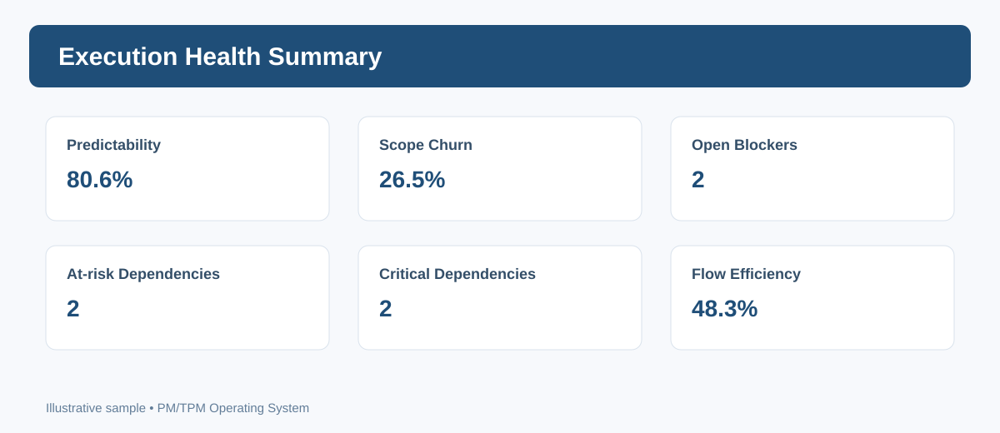

# Agile & Execution

## Operating loop
Plan/commit → execute → surface blockers/dependencies → inspect flow/outcomes → adapt → communicate.

- [Execution Cadence](Execution-Cadence.md)
- [Predictability & Scope Churn](Predictability.md)
- [Flow & Blockers](Flow-Blockers.md)
- [Execution Checklist](../18-Checklists/Iteration-Execution.md)
- [Off-Track Playbook](../17-Playbooks/Iteration-Off-Track.md)

Metrics are system/planning signals, not individual performance scores.

## Sample Dashboard

*Illustrative preview. Values are sample data; use the operational templates for real projects.*
