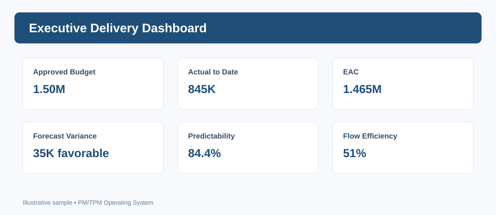

# Metrics & Dashboards

Phase 6 combines delivery, flow, quality and financial signals for decisions.

## Core metrics
Predictability, scope churn, cycle time, flow efficiency, escaped defects, release/change failure, recovery time, budget/EAC/variance and outcome status.

## Rule
A dashboard should answer **what changed, why it matters, and what decision/action is needed**. Metrics are system signals—not individual ranking scores.

See [Metric Dictionary](Metric-Dictionary.md) and [Executive Dashboard Guide](Executive-Dashboard.md).

## Sample Dashboard

*Illustrative preview. Values are sample data; use the operational templates for real projects.*
